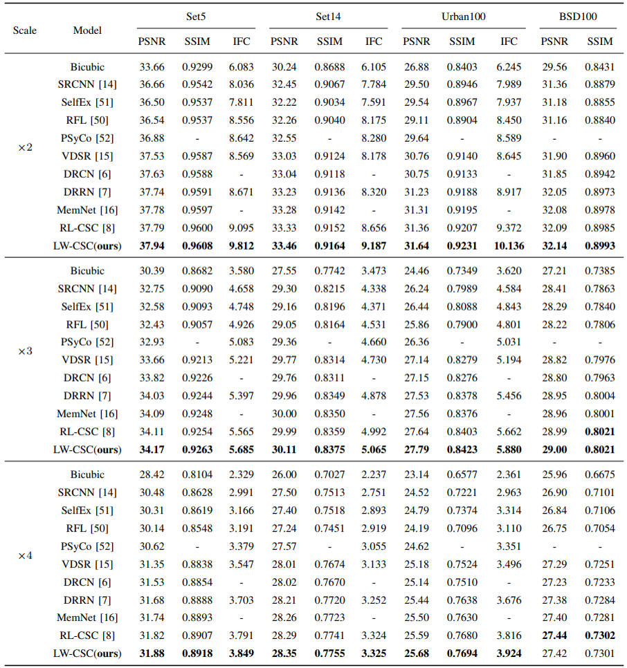
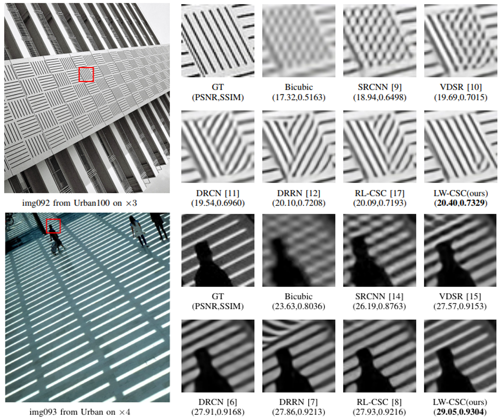
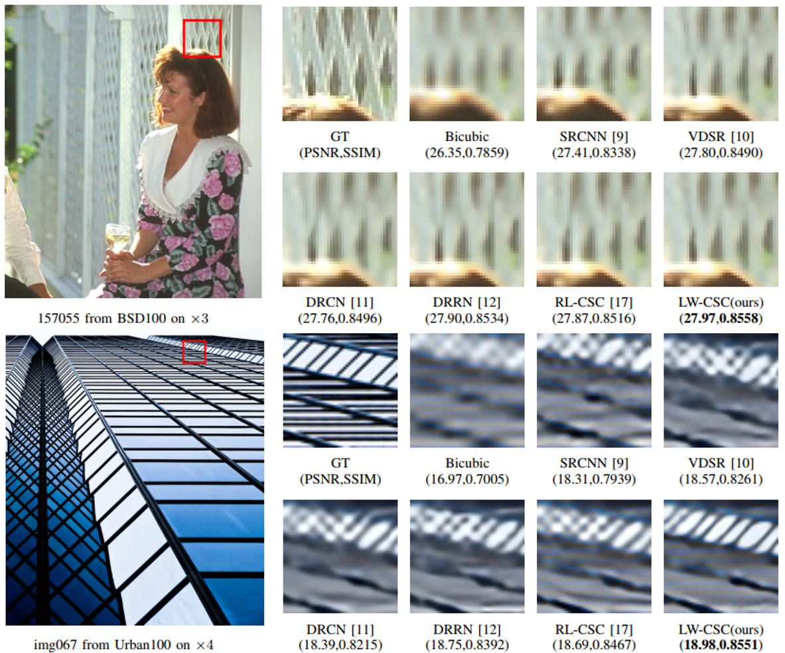
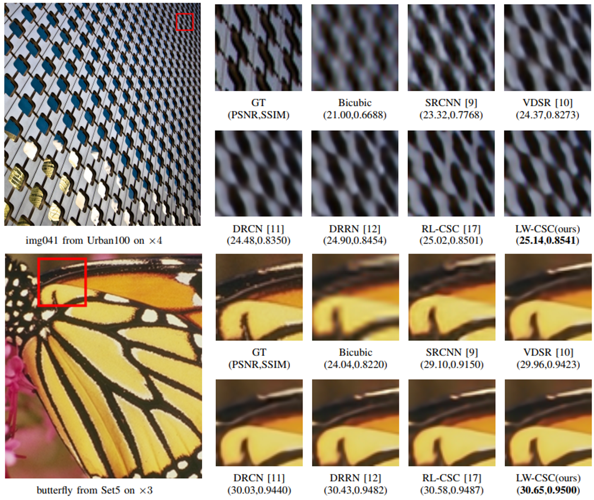
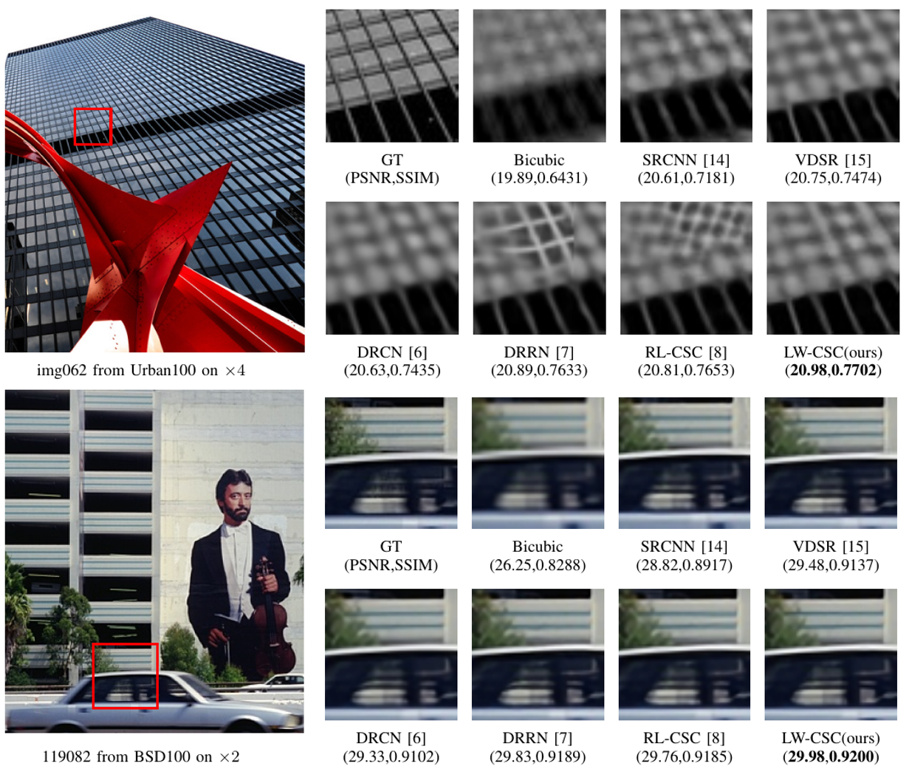
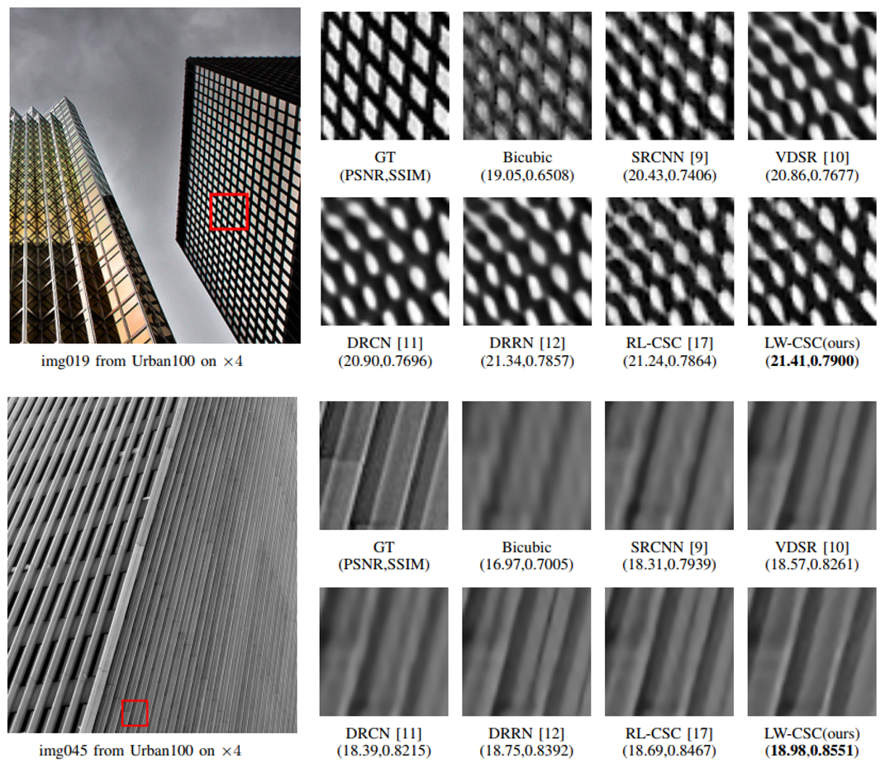
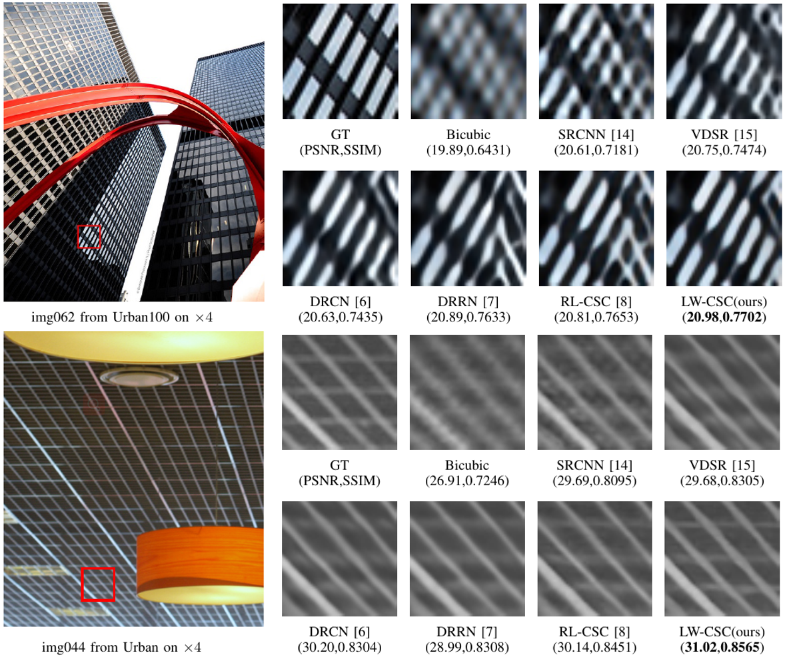

# Image Super-Resolution by Learning Weighted Convolutional Sparse Coding
This repository is for LW-CSC.

:smile:  Codes will be published soon.

## Contents
1. [Introduction](#introduction)
2. [Dependencies and Installation](#dependencies)
3. [Train](#train)
4. [Test](#test)
5. [Results](#results)
6. [Acknowledgements](#acknowledgements)

## Introduction
Over the past few decades, Sparse Coding (SC) has been successfully applied in a mass of image restoration problems. For single image super-resolution (SISR), most SC-based methods divide an image into a set of patches and process them separately, thereby ignoring the structural dependencies over the whole image. By contrast, Convolutional Sparse Coding (CSC) can make full use of the global correlation by nature since it copes with the whole image directly.  Based on this, we present a SISR model by Learning Weighted Convolutional Sparse Coding (LW-CSC). Extensive experiments demonstrate the superiority of our method to recent state-of-the-art SISR methods, in terms of both quantitative and qualitative results.

<br/>
<div  align="center">    
   
</div>
<br/>
<div  align="center">    
Figure 1. Architecture of the proposed Learning Weighted Convolutional Sparse Coding (LW-CSC).
</div>

## Dependencies and Installation
* Python 2 (Recommend to use [Anaconda](https://www.anaconda.com/distribution/#linux))
* [Pytorch 1.0.1](https://pytorch.org/)
* NVIDIA GPU + [CUDA](https://developer.nvidia.com/cuda-downloads)
* Python packages: pip install xxx
## Train
### Prepare training data
1. Download the 291 images ([Baidu Netdisk](https://pan.baidu.com/s/1bEajYJm_X5aVoXdS3RcbQg) psw:ryjr), and place them in './data' folder.
2. cd to './data', and run xxx.xx to generate training data.

### Begin to train
1. (optional) Download the model for our paper and place it in './model'.
2. Run the following script to train.

    ```bash
    bash train.sh
    ```

## Test
### Quick start
Run xxx.m to reproduce PSNR/SSIM/IFCs for paper.
### The whole test pipeline
1. Download the model for our paper and place it in './model'.
2. Run eval.py to generate *.mat for test.
3. Run xxx.m to reproduce PSNR/SSIM/IFCs for paper.

## Results
### Quantitative Results
    
Table 1. Average PSNR/SSIM/IFCs for scale factor x2, x3 and x4  on common benchmarks. The best results appear  **in bold**.
<div  align="center">    
   
</div>

### Visual Results
<div  align="center">    
   
</div>

<div  align="center">    
   
</div>

<div  align="center">    
   
</div>

<div  align="center">    
   
</div>

<div  align="center">    
   
</div>

<div  align="center">    
   
</div>

</br>

**For more investigation, please refer to our [main paper.]()   
All of these comparisons mainly show the effectiveness of our proposed method.**
</br>


## Acknowledgements
